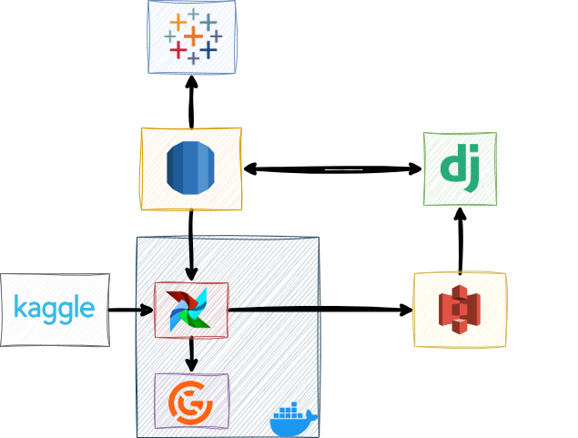
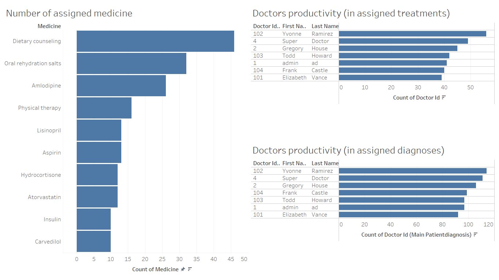
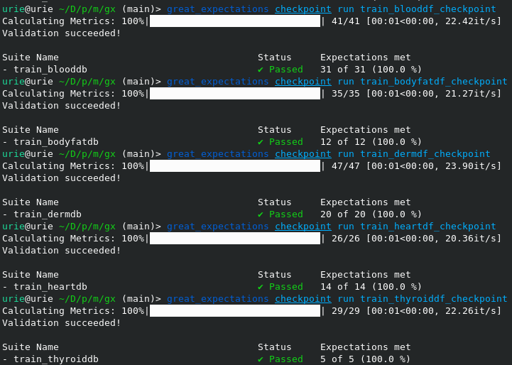

# MedicalML

## Description
MedicalML is a web-based application that leverages machine learning for medical predictions. It provides a comprehensive platform for doctors and patients to manage medical records and gain insights from predictive models. The application is designed to predict various medical conditions including cardiological disorders, dermatological conditions, thyroid disorders, liver diseases, and body fat percentage.

## Technologies used
- **Python**: The primary programming language used for backend development and machine learning models.
- **SQL**: Used for data transformations and preprocessing.
- **Django**: The web framework used for building the web interface.
- **Docker**: Used for containerizing the application for easy deployment.
- **Airflow**: Used for managing and scheduling data pipelines.
- **Terraform**: Infrastructure as Code (IaC) tool for managing cloud resources.
- **AWS S3**: Used for storing patient records for training and already trained ML models.
- **AWS RDS**: Used for database services.
- **Great Expectations**: Used for testing and validating the data.

## Features
- Patient and doctor record management via web interface.
- Predictive models for various medical conditions like general cardiological disorder, psoriasis, seborrheic dermatitis, lichen planus, pityriasis rosea, chronic dermatitis, pityriasis trichosanthes, hypothyroid, hyperthyroid, hepatitis, fibrosis, cirrhosis and predicting body fat percentage based on circumference of body parts.

## Architecture


Here is displayed data flow between components of the project. Data from Kaggle is used only once, when needed to create ML models, if they are not present. Then for training is used data from RDS queried with SQL in Airflow. When model is trained, it is uploaded to S3 for further use in Django views. 

## Data visualization



In this dashboard we can see variable statistics about patients, their treatment and diagnosis.

## Data validation
Before using data in training we must validate that preprocessing is correct and nothing left behind. Great expections is used to check whether correct types are used, no missing or incorrect (in case of finite number of variants) values and overall tables structure. This is crucial part of training pipeline and tests are done automatically inside of Airflow DAG. These checks are applied for each machine learning model that are being used and trained. 



## Installation and usage

To install and run this project, follow these steps:
Clone the repository to your local machine.

### Cloud part
1. Initialize Terraform with 
```
terraform init 
```
2. Enter your region, Access key and Secret access key in main.tf file
3. Change name of S3 bucket.
4. Plan your resources with
```
terraform plan 
```
5. Create your resources with
```
terraform apply 
```
### Local part
1. Build the airflow image with
```
docker build -f Dockerfile.airflow . -t airflow-ml 
```
2. Place your AWS RDS credentials from console page into settings.py file.
3. Migrate database with
```
python3 manage.py makemigrations
python3 manage.py migrate
```
4. Run Apache Airflow with 
```
docker compose up
```
5. Start Django with 
```
python3 manage.py runserver
```

### Set up first doctor account
Since this app is designed to for use at specific medical organizations, Doctor account cannot be registered just as simply as Patient. This limitation is because Doctor's accounts have permission to interact with private information of Patients. 
1. Create Django admin user with
```
python3 manage.py createsuperuser
```
2. Login into Django admin console and create User model.
3. Create DoctorBaseRecord assigned to created User in previous step.
   
## Future work
- Improve the accuracy of the machine learning models.
- Add more predictive models for other medical conditions.
- Enhance the user interface for better user experience.
- Implement usage of SCD for retaining of past user data.
- Implement registration of Doctor accounts with permissions granted only after admin confirmation (auto removal of this account if not activated after some time)
- Let Doctors see Patients account only if previously interacted or searched for them (no more all profiles listed at main page)
  
## Contact
For any queries or suggestions, please feel free to reach out to us at `a.lepilo.soft@gmail.com`.
